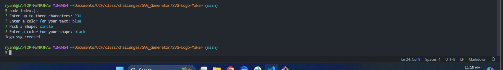
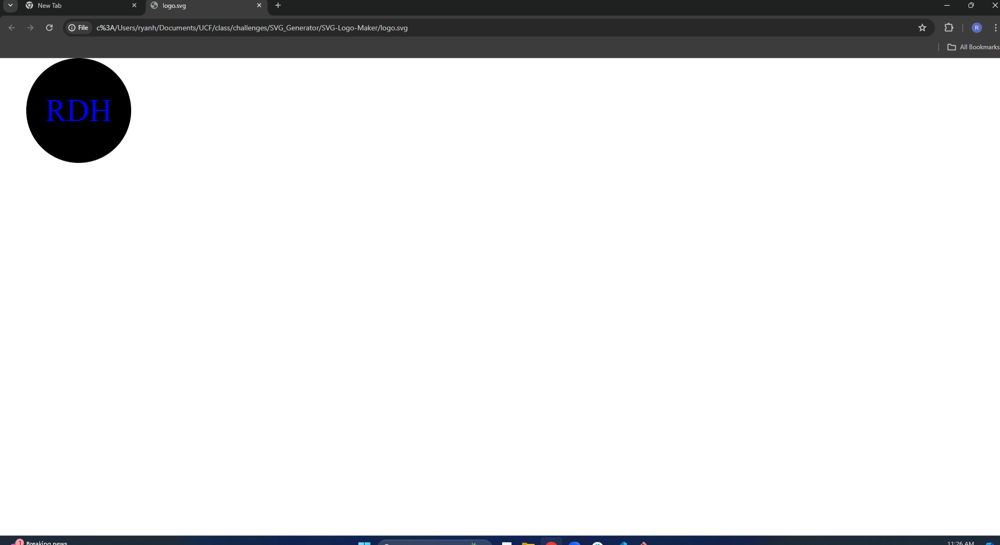
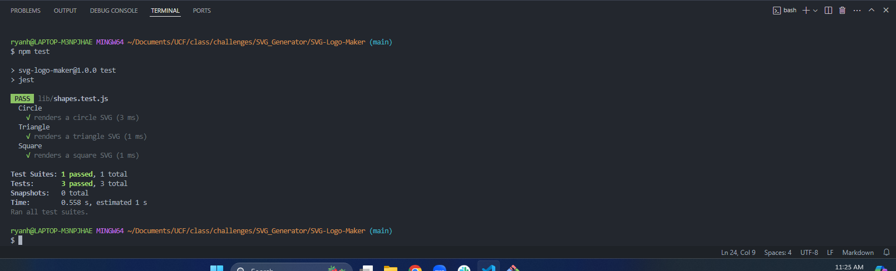

# SVG-Logo-Maker
        
## Description

I was motivared in this challenge to be able to make my own logo so I don't have to hire a graphic designer to make one. The goal I wanted to accomplish was after a series of questions a SVG Logo is generated and I can view it in the browser. I also wanted to be able to run tests for my shapes to know that they would generate. I learned how to create a SVG with some xml to view in browser and also learned how to write a test and let them run with jest.

## Website Link

https://watch.screencastify.com/v/fcXSTWQLlpCX5vefMJGS
          
## Installation
npm install
          
## Usage
  

## Tests
npm test
          
## Questions
If you have any questions or need further clarification, you can reach me at [ryanhinson118@gmail.com](mailto:ryanhinson118@gmail.com) or visit my GitHub profile at [https://github.com/RyanH118](https://github.com/RyanH118).
 